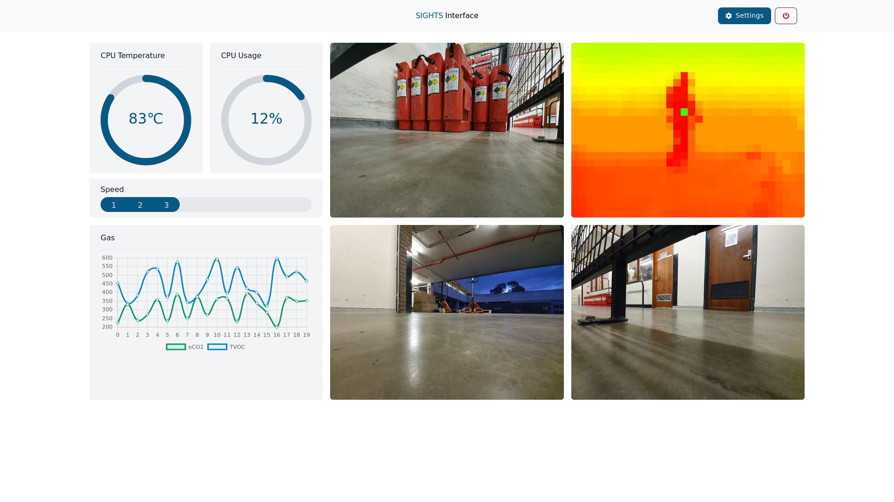

# Sights Lite



A rewrite of [Sights](https://github.com/sightsdev/sights), designed to address the steep learning curve, outdated framework and difficult extensibility.

It presently makes a number of core design decisions different to Sights including a purely declarative semi-stateless model based on a single hardware configuration file, RESTful APIs instead of WebSockets, and recurring API calls instead of streaming of sensor data. Some of these decisions may change before the final version.

It uses a modern stack: React on the frontend and Starlette/FastAPI (Python) on the backend. Frontend uses Typescript with endpoints generated from the backend applications. UI is primarily built using TailwindCSS.

Still in early stages of development. It may eventually replace Sights (as Sights 2.0) once a suitable level of extensibility (particularly some sort of plugin support) and abstraction from the rescue robotics domain is reached. 

### Quick start

- **Prerequisites**: Python 3.11+ and Node 18+. Prefer Yarn for the frontend.
- Familiarity with both Python and modern JavaScript environments will be helpful.

This repository contains both the frontend (`/src`) in React/Typescript and the backend (`/server`) in Python.

#### Backend (FastAPI)

The backend uses [Python virtual environments](https://docs.python.org/3/library/venv.html).

```bash
# From the repo root
cd server
python3 -m venv .venv
source .venv/bin/activate
pip install -r ../requirements.txt

# Run the API (http://127.0.0.1:8000)
uvicorn server:app --reload --host 127.0.0.1 --port 8000
```

- **Config**: Edit `server/settings.toml` to enable/disable components (drive, arm, cameras, sensors). Changes can be hot‑reloaded via `POST /api/reload` or by restarting the server.

#### Configuration: `server/settings.toml`

The backend loads all hardware, cameras, and sensors from `server/settings.toml` at startup. A minimal, hardware‑free setup is recommended for first run:

```toml
[drive]
enabled = false  # use DummyConnection (no serial required)

[arm]
enabled = false  # skip ServoKit initialisation

[camera]
width = 640
height = 480
framerate = 30
quality = 80

  [camera.devices]
  # Leave empty if you don't have a local webcam
  # front = 0

[sensors]
  [sensors.system_info]
  type = "system_info"
  enabled = true

  [sensors.random]
  type = "random"
  enabled = true
  minimum = 10
  maximum = 20

  [sensors.gas]
  type = "sgp30"
  enabled = true
  mock = true       # generate data without hardware

  [sensors.thermal_camera]
  type = "mlx90640"
  enabled = true
  interpolate = false
  mock = true       # generate data without hardware
```

Tips:
- If you have a webcam, discover indices via `GET /api/camera/all` and set them under `[camera.devices]` (e.g. `front = 0`).
- Keep `drive.enabled = false` and `arm.enabled = false` until real hardware is connected.
- Many sensors support `mock = true` for no‑hardware testing (e.g. `sgp30`, `mlx90640`, `mlx90641`).
- After editing, call `POST /api/reload` to apply changes without restarting.

#### Frontend (React)

```bash
# In a separate terminal, still at repo root
yarn install
yarn start
```

- The dev server runs on `http://localhost:3000` and forwards `/api/*` to `http://127.0.0.1:8000`.

#### Generate API client (optional)

If you change backend endpoints, regenerate the typed client (backend must be running):

```bash
yarn generate-client
```

#### Production build

```bash
yarn build
# Start the backend from the `server` directory as above; FastAPI serves the static build mounted at '/'
```

That’s it — backend on `:8000`, frontend on `:3000` (dev) or served by FastAPI (prod).

### Connecting from remote PC

Check the robot's IP address (e.g. by running `ip a`) and access `http://<robot_ip>:3000` in a browser from a computer on the same network.

## Roadmap

This isn't a real roadmap, more of a list of suggestions on what this project needs to be usable and also succeed the original Sights project:

### Backend

1. Add some more sensor and motor plugins based on commonly used hardware.
  - This would make a great first issue for someone getting started on the project. Following the existing examples (e.g. `MLX90641Sensor` class) with a new Adafruit sensor Python library swapped in should get you 90% of the way there.
2. The backend is reasonably well designed to have a layer of abstraction between hardware and controls, e.g. there is both a `DummyConnection` and `SimpleSerialConnection` that implement the `Drive` interface. This interface specifies what methods an implementation should implement (e.g. `move_motor`). A few suggested changes:
  - Split the interfaces and the implementations. Ideally long term we would just expose the interfaces and then have a plugins folder or similar for the implementations, i.e. all motor code and sensor code would be written in plugins.
  - The arm code unfortunately doesn't follow this pattern, but it can and definitely should be updated to do so
3. Reimplement something similar to WebSockets for sending sensor data, but with configurable polling rates per sensor and optimisations like deduplication of packets. Possibly look into [Server-Sent Events](https://en.wikipedia.org/wiki/Server-sent_events)

### Frontend

1. Migrate the frontend from Create React App to Vite (as the former is deprecated).
2. Add some more commonly used cards. At the moment, it's really just camera, grid, circle graph and line graph for displaying info. Original Sights also had a few other options.
3. Real configurability for page layout. Drag-and-drop rearranging of components. Create a more generic pattern in `SelectableCard` so every single card doesn't need to be defined there. I was not very good at React when I wrote this project.
4. Use a real state management library for sensor data. Something like [Redux](https://react-redux.js.org/) would work, but [React Query](https://tanstack.com/query/latest) might be a better idea - a real query management pattern is needed anyway.
  - This also opens up possibilities to store recent sensor data etc. in a backend cache (Redis?) so the graph history is populated on page load. Currently all that data is cleared if you reset.
  - At the moment we are fetching and managing state in the `useApi` hook. React Query does that and about 100x more (query invalidation, request deduplication, automatic refetching, stale cache tracking, error catching, etc.).
5. I recall finding it tricky to design a nice and generic way to allow the frontend graph/card components to take arbitrary data from the sensor endpoints. Thinking about it now, several years later, I'd probably do something like:
  - Create a generic interface for scalar data that all the sensor plugins should return. Something like: (using MLX90614 IR temp sensor as example)
  **Definition**: (fetched from API and used by the frontend when setting up the card):
  ```
  {
    timestamp: '2025-08-12T14:01:15.675Z',
    type: 'scalar',
    sources: [
        {
            id: 1,
            name: "object_temperature",
            description: "the IR temperature reading of the object it's pointed at",
            min: 0,
            max: 50
        },
        {
            id: 2,
            name: "ambient_temperature",
            description: "the ambient room temperature,
            min: 0,
            max: 50
        }
    ]
  }
  ```
  **Payload:** (sent via API or websocket):
  ```
  {
    timestamp: '2025-08-12T14:01:15.675Z',
    data: [
        {
            source_id: 1 
            value: 26
        },
        {
            source_id: 2,
            value: 23
        }
    ]
  }
  ```
  - Then each graph that shows scalar data (circle, bar, line, etc.) can take any sensor that sends data like this. Each graph can pick and choose what it actually renders. For example, the circle graph might only take a single `source`, so the user can decide if a particular circle graph should display `ambient` or `object` temperature in the above example.
  - For non-scalar stuff (like the Pixel grid, which perhaps could be considered vector or image data) you could create an equivalent interface if you want, but might be less useful since I'm not sure if there are many worthwhile alternative ways to display it.
